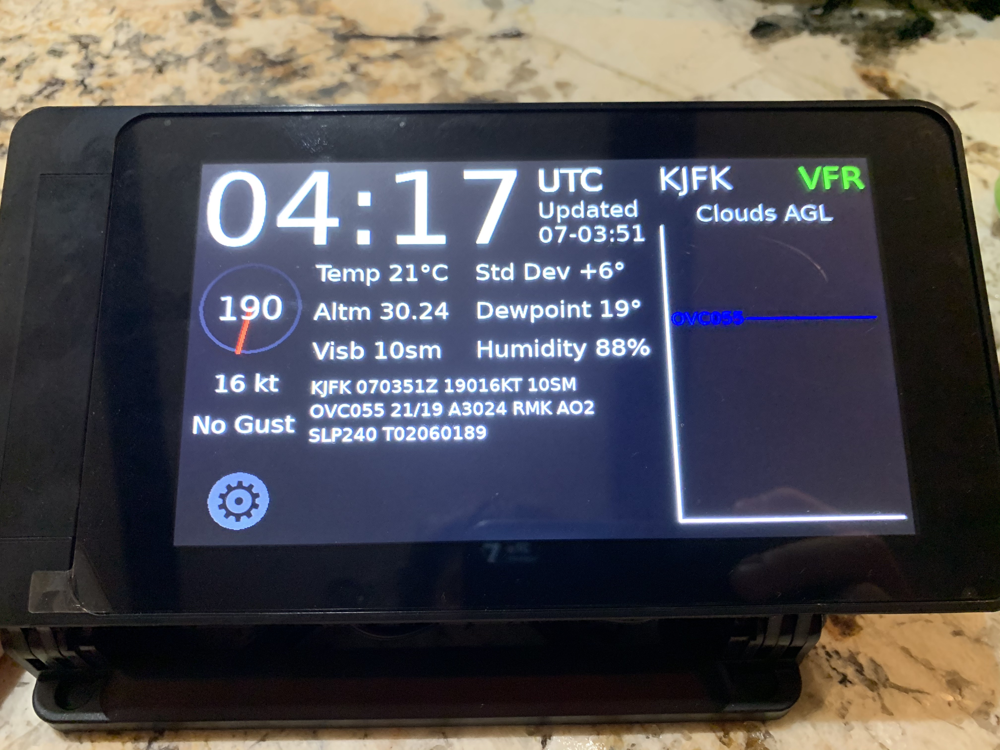
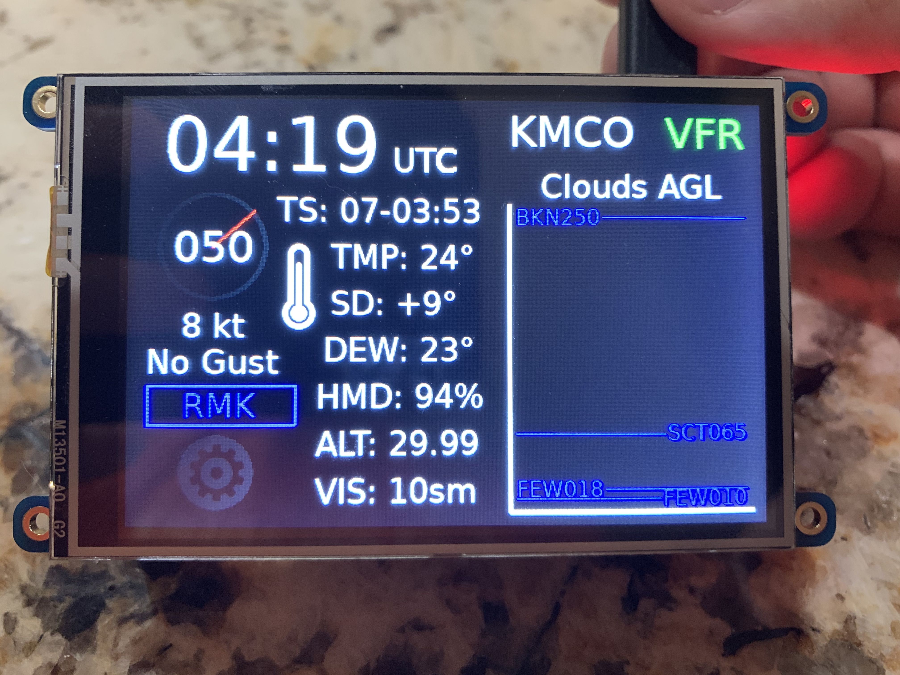
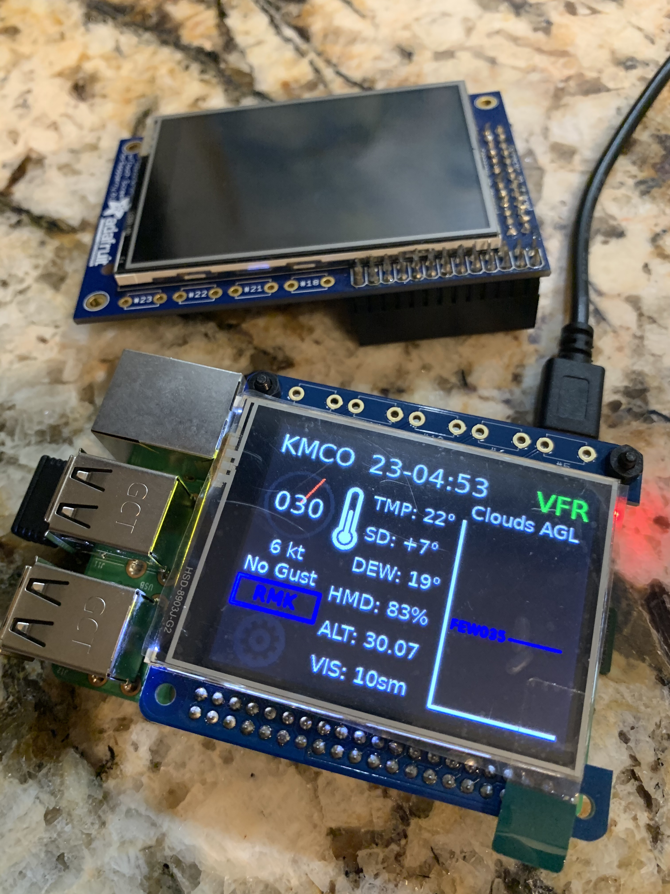

# METAR-RasPi

Display ICAO METAR weather data with a Raspberry Pi. [Watch the demo](https://www.youtube.com/watch?v=TBnDOQ-6RTw)!

## Basic Setup

Unless you know what you're doing, it is recommended to start with a fresh install of [Raspbian Desktop from NOOBS setup](https://www.raspberrypi.org/downloads/noobs/). The rest of these instructions are based on a clean Raspbian Install install.

This project requires Python 3.6+ to run the `avwx` library. Run these commands to see if you have it already. Whichever one prints 3.6+, use that.

```bash
python -V
python3 -V
python3.7 -V
```

If you're running this on a Raspberry Pi that does not yet have 3.6+ on it, you can find [instructions here](https://gist.github.com/dschep/24aa61672a2092246eaca2824400d37f).

## Screen

This version runs the METAR program on a touchscreen display.

### Hardware

Officially supported/tested displays:

[Raspberry Pi 800x480 Touch Display](https://www.raspberrypi.org/products/raspberry-pi-touch-display/) | [PiTFT Plus 480x320 3.5" TFT+Touchscreen](https://www.adafruit.com/product/2441) | [Adafruit 320x240 2.8" TFT+Touchscreen](https://www.adafruit.com/product/2298)
:---:|:----:|:----:
 |  | 

However, the program can be run on any screen or computer in its own window for development purposes.

If you are using the official Raspberry Pi Touch Display, you won't need to do anything else to configure the display. Skip below to the Config section.

If you are using the Adafruit PiTFT displays, Adafruit has a script that will configure the Pi to use the type of screen you have.

```bash
wget https://raw.githubusercontent.com/adafruit/Raspberry-Pi-Installer-Scripts/master/adafruit-pitft.sh
chmod +x adafruit-pitft.sh
sudo ./adafruit-pitft.sh
```

Reboot the Pi with the screen attached before continuing.

Unfortunately, the desktop doesn't configure itself to have a 1:1 pixel scaling ratio. We can fix this by editing the boot config.

```bash
sudo nano /boot/config.txt
```

Find the line towards the bottom that starts with `hdmi_cvt=` and change the first two numbers to be the same pixel resolution as your display. For example, if you're using the 480x320 PiTFT, your line should look like this:

```text
hdmi_cvt=480 320 60 1 0 0 0
```

Restart the Pi one last time for the display change to take effect.

### Program Config

Common project settings are stored in `config.py`. For the screen, the ones you may want to change are:

- `layout`: Size of the screen. Loads the layout from `./screen_settings`
- `shutdown_on_exit`: Set to `True` to shutdown the Pi when exiting the program
- `clock_utc`: Clock displays UTC or local time. Not applicable to 320x240 size

## Plate

This version runs the METAR program on an LCD character display with physical buttons.

### Hardware

The METAR plate uses the [Adafruit 16x2 LCD Pi Hat](https://www.adafruit.com/product/1110). You will need to use a different client library if using a different board.

You may wish to try some [sample programs from their tutorial](https://learn.adafruit.com/adafruit-16x2-character-lcd-plus-keypad-for-raspberry-pi/overview) to verify that the plate is working, but there is no additional software setup necessary to use the plate.

### Program Config

Common project settings are stored in `config.py`. For the plate, the custom configs involve button and scrolling intervals. You may wish to change:

- `shutdown_on_exit`: Set to `True` to shutdown the Pi when exiting the program
- `include_remarks`: Set to `True` to include the remarks section in scroll line

## Running

Install the dependencies using the Python version from above. Note: change the commented libraries in `requirements.txt` for the plate version.

```bash
pip3 install -r requirements.txt
```

Then just run the screen file to boot the display.

```bash
python3 screen.py
```

**Note**: If you are starting the screen program via SSH, you should prepend the `DISPLAY` config in the Python call:

```bash
DISPLAY=:0 python3 screen.py
```

On the main display, pressing the RMK, WX, WX/RMK displays more METAR information. Pressing the gear displays more options.

## Startup

If you want the METAR screen to run on boot, we can use autostart by creating this file:

`/home/pi/.config/autostart/metar.desktop`

```text
[Desktop]
Type=Application
Name=Metar
Exec=/usr/bin/python3 /home/pi/METAR-RasPi/screen.py
```

Make sure the Exec line uses your version of Python and points to your project folder.

Replace `screen.py` with `plate.py` to run the METAR plate.
